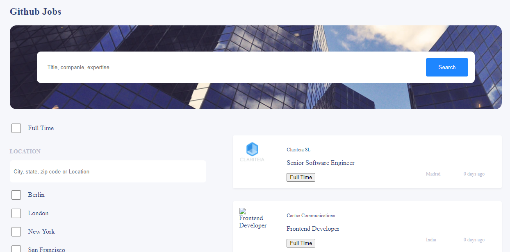
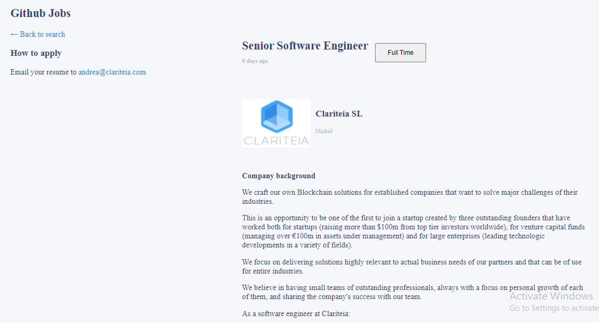

# Github Jobs

<h1 align="center">Github Jobs</h1>

<div align="center">
  <h3>
    <a href="https://fanilo-github-jobs.netlify.app/">
      Demo
    </a>
    <span> | </span>
    <a href="https://github.com/lightme-fan/github-jobs">
      Solution
    </a>
  </h3>
</div>

<!-- TABLE OF CONTENTS -->

## Table of Contents

-   [Overview](#overview)
    -   [Built With](#built-with)
-   [Features](#features)
-   [How to use](#how-to-use)
-   [Contact](#contact)
-   [Acknowledgements](#acknowledgements)

<!-- OVERVIEW -->

## Overview




### My Project

- You can see the demo of this project by visiting this link **https://fanilo-github-jobs.netlify.app/**.

1- In this project, I come accross with a lot of experiences. I find out how useReducer and filter work together. I also install few packages which I never came accross such as react-js-pagination. So, I find out how pagination work in react.

2- This project has few **folders** which contain few files. Fistly, I have a big ***components*** folder. In this folder, there are two folders and six js files. Those two folders are **search** and **style** which contains **style.js** file. In ***search*** folder, there are four js files. Those six files are **FilterByLocation**, **FilterByType**, **MainSearch** and **Search**.

- These are also the 6 js files in the big components
  - App.js
  - ContextProvider.js
  - Details.js
  - Header.js
  - Jobs.js
  - useAppReducer.js

- I also a **pags** folder in which I store **JSX**. This folder has four js files which are:
  - CityElement.js
  - FormSearchLocation.js
  - FullTimeElem.js
  - JobElement.js

- I also Created a **citiesData.json** to store the list of cities so that I can search a specific job by those cities.

- I have an **index.scss** for default styles because I used **styled-components** instead. 

3- If I had more time to accomplish this project, I would have improved my useReducer and the fetch data. I also could have added the icons on the first and the second input search. 

4- I learnt a lot from this project. I learnt how to build pagination in react. I as well learnt how to convert string to html elements because the job descriptions are string. But there are html tags in it. So I tried to display those html.

5- The most challenging part in this project is the **fetch data**. I found it hard because I always get an error which says that the **CORS** of the api is broken.

### Built With
This project is build with [React](https://reactjs.org/)

## Features
These are the feature of this project

- Searching jobs by title or company
- Searching jobs by location or city
- Searching by type, Just check the full time checkbox
- Search by checking the city checkboxes
- At the bottom of the job list, you can see other jobs by going to the next page.

## How To Use

To clone and run this application, you'll need [Git](https://git-scm.com) and [Node.js](https://nodejs.org/en/download/) (which comes with [npm](http://npmjs.com)) installed on your computer. From your command line:

```bash
# Clone this repository
$ git clone https://github.com/lightme-fan/github-jobs

# Install dependencies
$ npm init

$ npm install react
$ npm install react-dom
$ npm install react-router-dom
$ npm install react-js-pagination
$ npm install react-axios
$ npm install styled-components

# Run the app
$ parcel index.html
```

## Acknowledgements

<!-- This section should list any articles or add-ons/plugins that helps you to complete the project. This is optional but it will help you in the future. For example: -->

## Contact

-   Website [Github jobs](https://fanilo-github-jobs.netlify.app/)
-   GitHub [lightme-fan](https://github.com/lightme-fan/github-jobs)
